# Cluster Architecture

This document provides a visual overview of the cluster architecture, explaining how the different components interact and work together.

## Overview

This cluster is a **GitOps-managed Kubernetes homelab** built on Talos Linux, with all infrastructure defined as code in this repository. Changes pushed to Git automatically sync to the cluster via Argo CD.

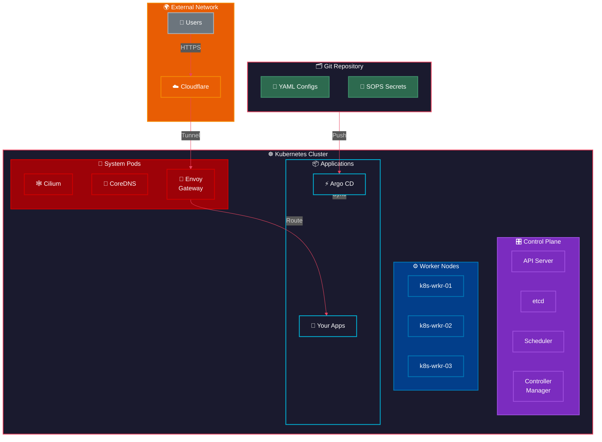

## High-Level Data Flow

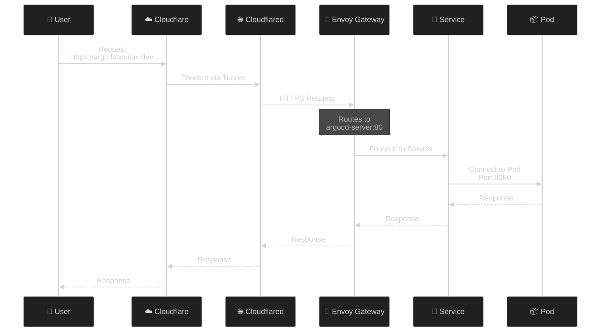

## Network Architecture

### IP Allocation

| IP | Component |
|---|---|
| `10.0.40.90-92` | Control Plane Nodes |
| `10.0.40.93-95` | Worker Nodes |
| `10.0.40.101` | Kubernetes API VIP |
| `10.0.40.102` | Internal Gateway (Envoy) |
| `10.0.40.103` | External Gateway (Envoy) |
| `10.0.40.153` | DNS Gateway (k8s-gateway) |

### CIDRs

| Network | CIDR |
|---------|------|
| Pods | `10.42.0.0/16` |
| Services | `10.43.0.0/16` |
| Nodes | `10.0.40.0/24` |

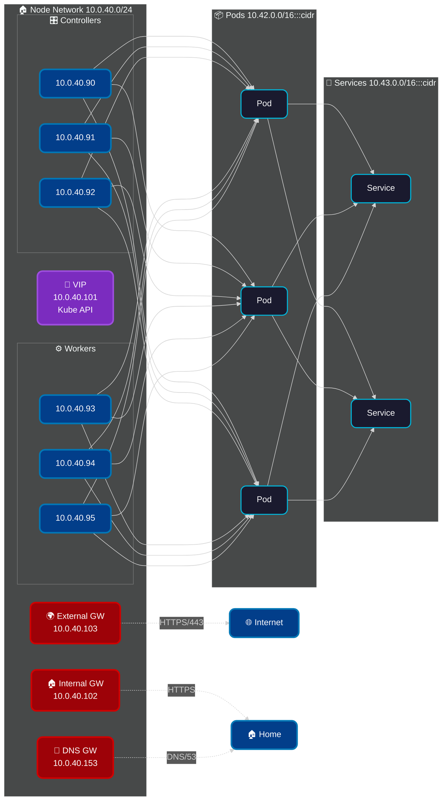

## Component Architecture

### GitOps Pipeline

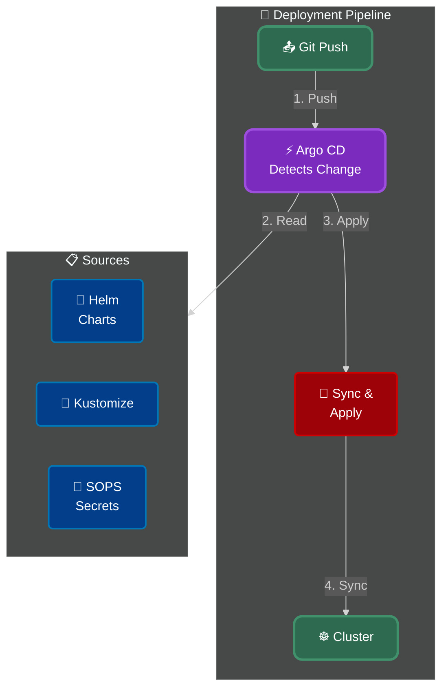

### Ingress Architecture

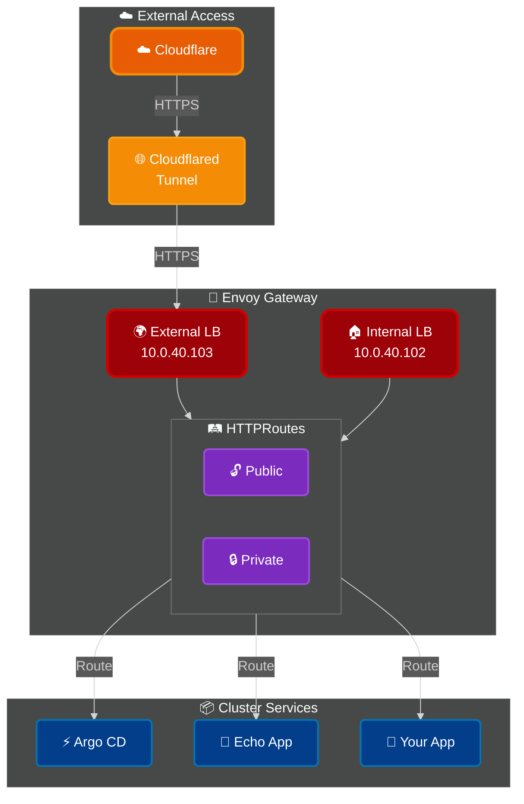

### DNS Resolution

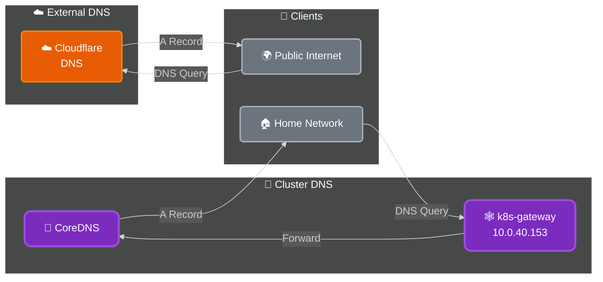

## Repository Structure

```
.
├── bootstrap/              # Initial cluster bootstrap
│   └── helmfile.d/        # Helmfile for bootstrap apps
├── kubernetes/            # Main GitOps manifests
│   ├── apps/              # Application Helm values
│   │   └── <namespace>/  # Organized by namespace
│   │       └── <app>/    # Individual app configs
│   │           ├── values.yaml
│   │           └── values.sops.yaml
│   ├── argo/              # Argo CD Applications
│   │   ├── apps/         # Application manifests
│   │   └── repositories/ # Repo definitions
│   └── components/        # Shared Kustomize components
├── talos/                 # Talos Linux configs
├── terraform/             # VM provisioning
├── templates/             # makejinja templates
├── cluster.yaml           # Cluster configuration
└── nodes.yaml             # Node inventory
```

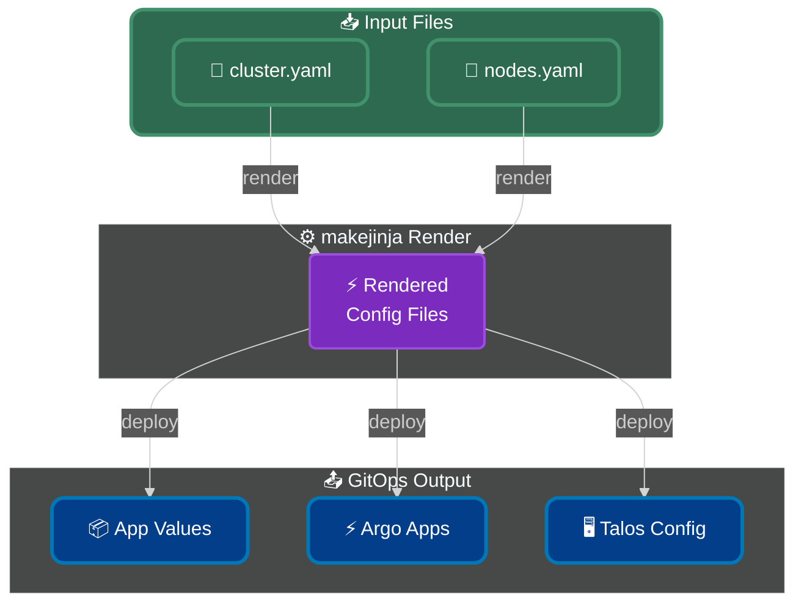

## Security Model

### Secrets Management

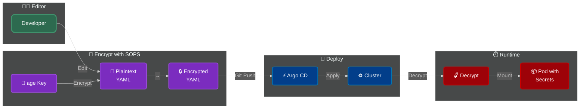

## Access Paths

### External Access (Internet)

```mermaid
%%{init: {'theme': 'dark'}}%%
flowchart LR
    %% Styles
    classDef user fill:#6c757d,stroke:#adb5bd,stroke-width:2px,color:#fff,rx:10
    classDef cloud fill:#e85d04,stroke:#f48c06,stroke-width:3px,color:#fff,rx:10
    classDef tunnel fill:#f48c06,stroke:#fca311,stroke-width:2px,color:#fff,rx:5
    classDef gateway fill:#9d0208,stroke:#d00000,stroke-width:3px,color:#fff,rx:10
    classDef service fill:#023e8a,stroke:#0077b6,stroke-width:2px,color:#fff,rx:5
    
    User["👤 User<br/>Browser"]:::user
    CF["☁️ Cloudflare"]:::cloud
    Tunnel["🌐 Cloudflared"]:::tunnel
    EG["🚪 Envoy<br/>External"]:::gateway
    SVC["🔗 Service"]:::service
    Pod["📦 Pod"]:::service
    
    User --"HTTPS"--> CF
    CF --"Tunnel"--> Tunnel
    Tunnel --"HTTPS"--> EG
    EG --"HTTP"--> SVC
    SVC --"Connect"--> Pod
```

### Internal Access (Home Network)

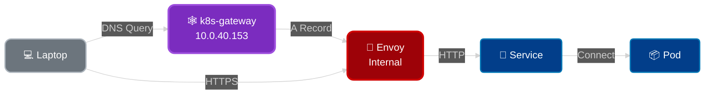

### Admin Access

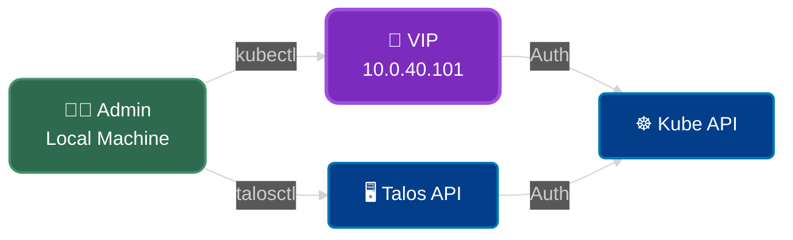

## Application Deployment Flow

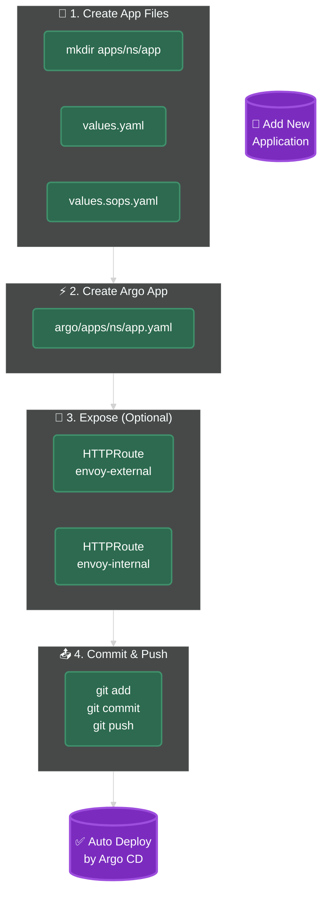

## Key Components

| Component | Purpose | Namespace |
|-----------|---------|-----------|
| **Talos Linux** | Immutable OS | - |
| **Cilium** | CNI, Network Policies | kube-system |
| **CoreDNS** | Cluster DNS | kube-system |
| **k8s-gateway** | Split DNS | network |
| **Envoy Gateway** | Ingress | network |
| **Argo CD** | GitOps Controller | argo-system |
| **cert-manager** | TLS Certificates | cert-manager |
| **Spegel** | P2P Registry Mirror | kube-system |
| **Reloader** | Config Reload | kube-system |
| **Cloudflared** | Cloudflare Tunnel | network |

## Troubleshooting Paths

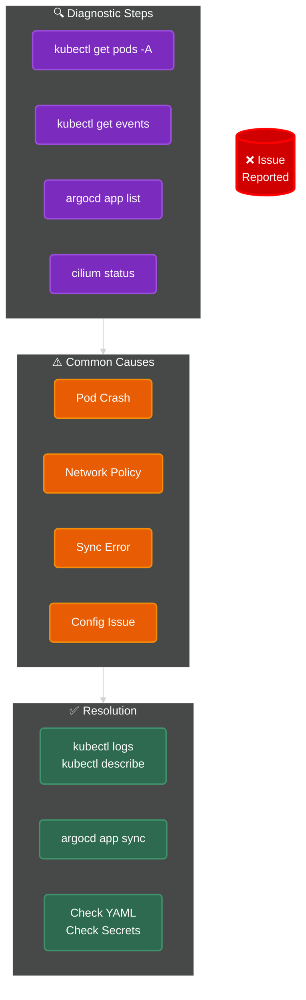
